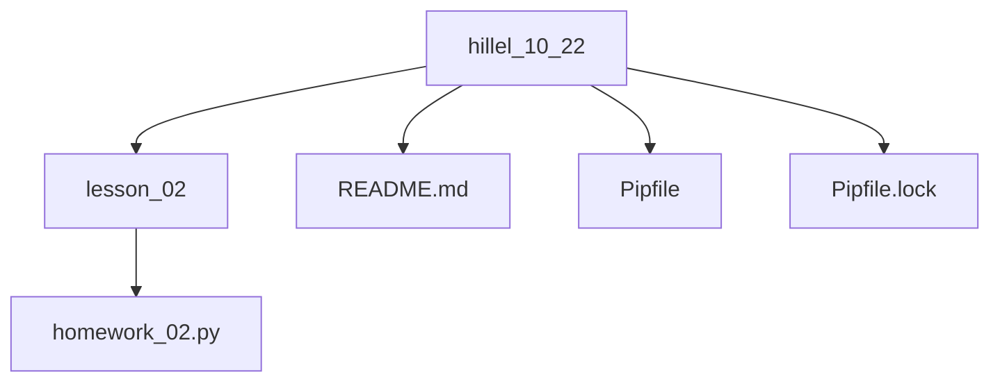

# <span style='color:blue' >Hillel course "Python Pro"</span>


## About

## Quick start

### Install deps

```bash
# Install pipenv
pip install pipenv

# Activate virtual env
pipenv shell

# Install deps
pipenv sync
```

#### Additional
```bash
# Regenerate Pipfile.lock file
pipenv lock

# pipenv lock & pipenv sync
pipenv update
```

## Use formatters and linters
```bash
flake8 5.0.4
black 22.10.0
isort 5.10.1
```