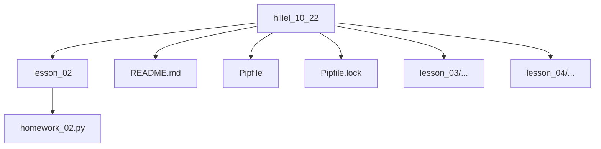

# <span style='color:blue' >Hillel course "Python Pro"</span>


## About

## Quick start

### File to download


[rockyou.txt](https://www.google.com.ua/url?sa=t&rct=j&q=&esrc=s&source=web&cd=&ved=2ahUKEwjTsaDV2JP4AhWNposKHd00BJYQFnoECAkQAQ&url=https%3A%2F%2Fgithub.com%2Fbrannondorsey%2Fnaive-hashcat%2Freleases%2Fdownload%2Fdata%2Frockyou.txt&usg=AOvVaw3snAERl1mU6Ccr4WFEazBd)


### Install deps

```bash
# Install pipenv
pip install pipenv

# Activate virtual env
pipenv shell

# Install deps
pipenv sync
```

#### Additional
```bash
# Regenerate Pipfile.lock file
pipenv lock

# pipenv lock & pipenv sync
pipenv update
```

## Use formatters and linters
```bash
flake8 5.0.4
black 22.10.0
isort 5.10.1
```